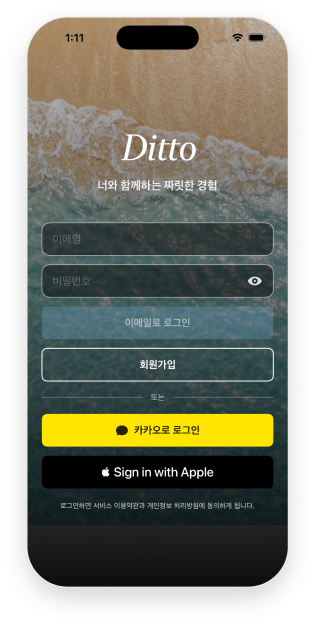
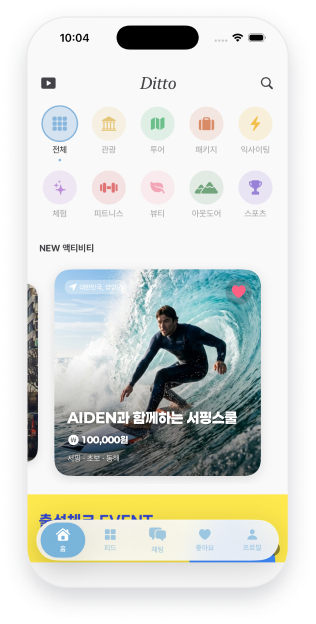
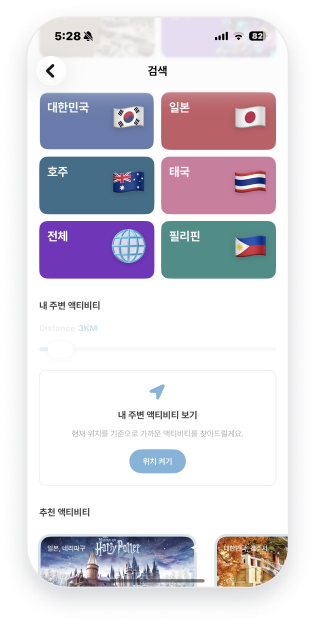
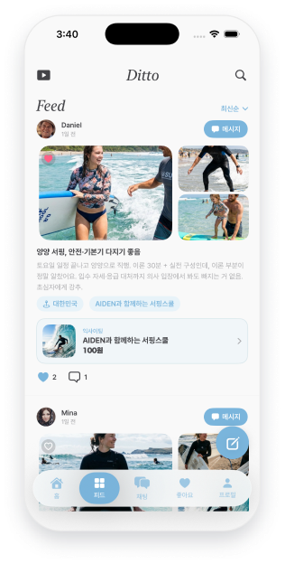
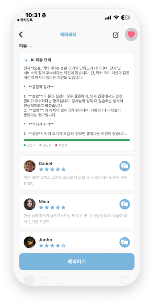
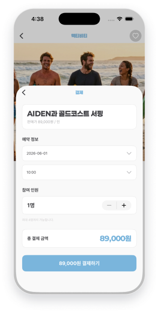
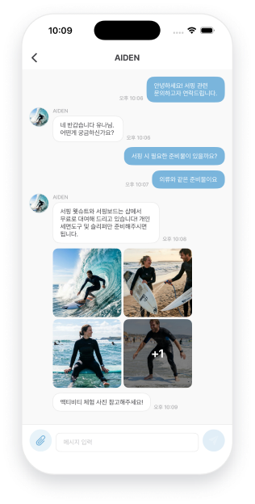
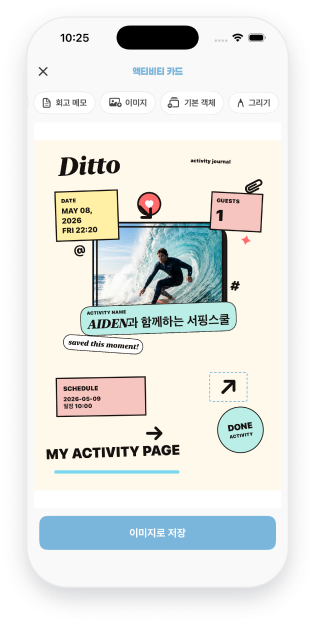

# Ditto

> 너와 함께하는 짜릿한 경험.

액티비티를 탐색·예약하고 후기를 공유하는 iOS 앱. 결제·인증·실시간 채팅·온디바이스 AI까지 단독 설계·구현.

| 항목 | 내용 |
|---|---|
| 기간 | 2026.04.20 ~ 2026.05.08 |
| 인원 | 단독 |
| 플랫폼 | iOS · iPhone |
| 최소 버전 | iOS 26.0+ |
| 카테고리 | 액티비티 · 커머스 · 소셜 |
| 아키텍처 | MVVM |

## Preview

<table>
  <tr>
    <td align="center"> <b>01 회원인증</b></td>
    <td align="center"> <b>02 홈</b></td>
    <td align="center"> <b>03 검색</b></td>
  </tr>
  <tr>
    <td align="center"> <b>04 피드</b></td>
    <td align="center"> <b>05 AI 리뷰 요약</b></td>
    <td align="center"> <b>06 결제</b></td>
  </tr>
  <tr>
    <td align="center"> <b>07 채팅</b></td>
    <td align="center"> <b>08 스트리밍</b></td>
    <td align="center"> <b>09 액티비티 카드 만들기</b></td>
  </tr>
</table>

## Screens

| # | 화면 | 핵심 기능 |
|---|---|---|
| 01 | 회원인증 | 이메일 / 카카오 / 애플 로그인, 회원가입 |
| 02 | 홈 | 액티비티 탐색, 카테고리 선택, 좋아요 토글, 프로모션 배너 |
| 03 | 검색 | 추천 · 카테고리 · 국가 · 내 주변 액티비티 |
| 04 | 피드 | 정렬, 무한 스크롤, 좋아요, 사진 보기, 피드 작성, 액티비티 연동 |
| 05 | AI 리뷰 요약 | Apple Intelligence 기반 한국어 자동 요약 |
| 06 | 결제 | 항목·시간 선택, 인원 조정, 결제 진행, 영수증 검증 |
| 07 | 채팅 | 메시지 전송, 사진·PDF 첨부, Socket.IO 실시간 수신 |
| 08 | 스트리밍 | HLS 비디오 재생, 자막·언어 선택, 좋아요 |
| 09 | 액티비티 카드 만들기 | 객체 추가·변형, 손글씨, 고해상도 내보내기 |

## Tech Stack

- **UI** — SwiftUI · MVVM · Observation
- **동시성** — Swift Concurrency (async/await · actor)
- **네트워크** — URLSession · Socket.IO
- **인증** — KakaoSDKAuth · AuthenticationServices
- **저장** — Keychain · UserDefaults · SwiftData
- **AI · NLP** — Apple Intelligence Foundation Models · NaturalLanguage
- **결제** — iamport-ios (포트원)
- **그래픽** — ImageRenderer · PencilKit · TextKit

## 핵심 설계 포인트

### 💳 이중결제 방지
결제 ID를 메모리와 로컬 두 곳에 보관. 네트워크 단절·앱 크래시 상황에서도 같은 ID로 멱등 검증 재호출하여 이중결제 차단.

### 🔐 토큰 갱신 동시 요청 직렬화
AccessToken 만료 시 진행 중인 refresh task를 공유. 다중 동시 만료 요청에서도 갱신은 한 번만, 나머지는 갱신 완료 후 동일 토큰으로 재시도.

### 🤖 리뷰 요약 2단 fallback
Apple Intelligence Foundation Models로 디바이스 내 한국어 요약. 미지원 환경에서는 평균 별점 및 긍정·부정 비율 한 줄로 대체해 빈 화면 차단.

## Build

1. `Ditto/Configurations/Secrets.xcconfig.example`을 복사해 `Secrets.xcconfig` 생성
2. 카카오·포트원·서버 키 등 비밀값 입력
3. `Ditto.xcodeproj` 실행 및 빌드

> `Secrets.xcconfig`, `GoogleService-Info.plist`, `AuthKey_*.p8` 등 민감 파일은 `.gitignore` 처리되어 있음.

## License & Contact

© 2026 KITAE KIM  
GitHub: [kkt6394/Ditto](https://github.com/kkt6394/Ditto)
